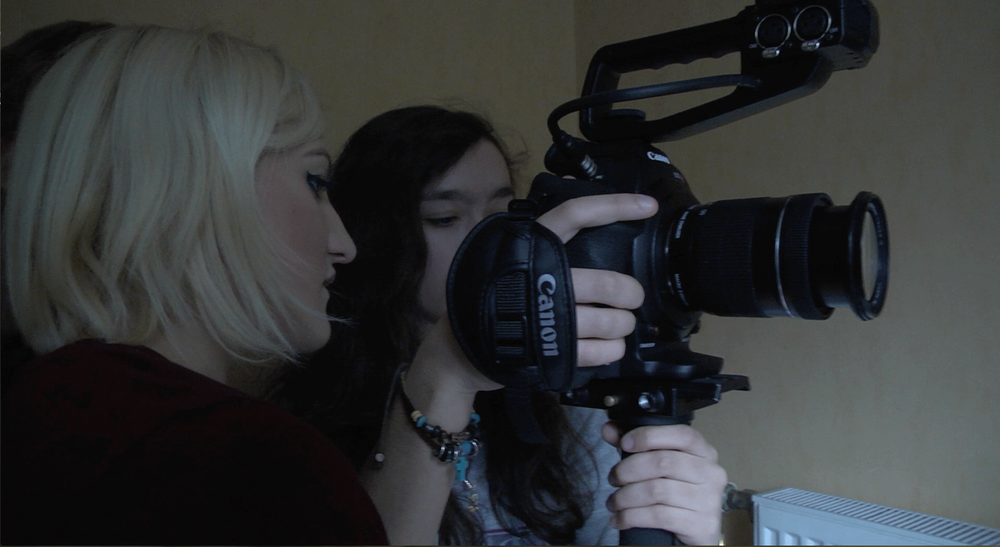

<!doctype html>
<html lang="fr">
<head>
  <meta charset="utf-8">
  <meta name="viewport" content="width=device-width" />
  <link rel="stylesheet" media="screen" href="screen.css" type="text/css" />
  <link rel="stylesheet" media="print" href="print.css" type="text/css" />
    
    
  <title>Tête de Linotte</title>
  <link rel="stylesheet" href="./css/style.css">
  
    
    
   
    
</head>
    
<body>
    
    <!-------"id="ancre-X" essentielle pour naviguer avec le menu du header --------------------->
    
    
    
    <!--
    
    <header class="header" id="ancre-header">      
            <ul id="menu">
                <a class="abc" href="#ancre-header">

</a>
                   <li> <a href="#">Film</a>
                    <ul>
                        <li><a href="#ancre-synopsis">Synopsis</a></li>
                        <li><a href="#ancre-trailer">Bande-annonce</a></li>
                        <li><a href="#ancre-personnage">Personnage</a></li>
                    </ul>
                </li>
                <li><a href="#ancre-equipe">Équipe de production</a></li>
                <li>
                    <a href="#">Making-of</a>
                    <ul>
                        <li><a href="#ancre-makingof">Video</a></li>
                        <li><a href="#ancre-photo">Gallerie photo</a></li>
                    </ul>
                </li>
                <li><a href="#ancre-contact">Contact</a></li>
            </ul>
       
    </header>
    -->
    <header class="header" id="main-header">
      
      
      
      

        
        
      

      
      <nav class="header-menu">
        <a href="#ancre-titre" title="Film">Film</a>
        <a href="#ancre-synopsis" title="Synopsis">Synopsis</a>
        <a href="#ancre-trailer" title="trailer">Teaser</a>
        <a href="#ancre-equipe" title="Equipes">Équipes</a>
        <a href="#ancre-personnages" title="Personnages">Personnages</a>
        <a href="#ancre-film" title="Film">Film</a>
        <a href="#ancre-makingof" title="Making Of">Making Of</a>
        <a href="#ancre-photo" title="Gallery">Gallery</a>
        <a href="#ancre-reseauxSociaux">Réseaux Sociaux</a>
      </nav>
      
    </header>
    
    
    
    
        <section id="ancre-titre">
                           
            <video autoplay loop poster="./img/FondNoir.jpg" id="titre-video">
            <source src="video/Bokeh6400.mp4" type="video/mp4">
        </video>
                    
      
Tête de Linotte
 

            <!--    <button class="button-video-synopsis">Pause</button>  -->
    </section>
    
    
    <!-- Synopsis -->

    <section class="synopsis">
        
       
        
        <h3><a name="ancre-synopsis">Synopsis</a></h3>
        
Linotte, ou line pour les ami(e)s, est une vraie tête de Linotte. Quoi qu’elle fasse, même avec des mémos, elle reproduit 
toujours une routine qui ne se passe jamais normalement. Chaque jour, faire les choses du quotidien qui se révèle très 
compliqué pour elle. Un exemple simple, linotte souhaite se brosser les dents, mais problème, elle ne sait plus où elle a 
mis sa brosse à dents... Malgré ce souci, Linotte le vit bien. Elle a quelques amis sympathiques, des professeurs 
compréhensifs, une famille compatissante. Tout le monde la trouve juste maladroite et très tête en l’air, rien de plus 
inquiétant. Sauf Céline, une amie de classe de Linotte, qui trouve que ses problèmes son anormaux. Que cache vraiment 
la santé de Linotte 
   

            </section>
    
    
        <!-- fin Synopsis -->
    
    
    
    
        <!-- Teaser -->
    
    <section class="trailer">
        <a name="ancre-trailer"><h2 id="Titre-Teaser">Trailer</h2></a>
        

<iframe width="560" height="315" src="https://www.youtube.com/embed/q5IIGV0-HrM" frameborder="0" gesture="media" allow="encrypted-media" allowfullscreen></iframe>
            
            <!------- Pour integrer une video : -------------------->
             <!---  1.Sur votre ordinateur, accédez à la vidéo YouTube          que vous souhaitez intégrer.
                    2.Sous la vidéo, cliquez sur Partager .
                    3.Cliquez sur Intégrer.
                    4.Copiez le code HTML figurant dans la zone qui s'affiche.
                    6.Collez-le ensuite dans le code HTML de votre blog ou de votre site Web.----->
            <!------------------------------------------------------>
            
        

    </section>
    
    
            <!-- fin Teaser -->
  
  <!----------------------- EQUIPES ------------------------------>   

    
    
        <section class="equipe">

<a name="ancre-equipe">Équipe</a>

    

  <ul>
    <li>
      

        <a href="#">
          <h2>Laure-Hélène Botti  Réalisateur | Chef de projet  Web Designer | Monteur</h2>
            

                 Alias LowBot fut la réalisatrice de ce court-métrage. Son rôle fut de donner les lignes directrices à 
                 l'équipe technique, de s'assurer que le scénario fut correctement respecté, ainsi que le déroulement 
                 du tournage et les prises de décisions. Un grand pouvoir implique de grande responsabilité. 
                 
                 En second temps, elle fut le couteau suisse du court-métrage "Tête de Linotte" puisqu'elle fut aussi
                 la chef de projet. Son rôle fut de diriger l'équipe sur les travaux de chaque membre ainsi que d'apporter
                  les modifications sur les différents travaux proposés. Ce fut aussi l'un des monteurs du 
                 court-métrage (corrections d'ensemble, colorimétries, sons et effects spéciaux). 
                 C'est elle aussi qui vous coda ce magnifique site Web.
                 
              Sa phrase culte: "Si vous cherchez quelques choses, c'est dans mon c*l." Un vrai couteau-suisse on vous dit ;)
 

        </a>
      

    </li>
    <li>
      

        <a href="#">
          <h2>Lucas Durot  Assistant Réalisateur | Monteur Teaser </h2>
            
Lucas fut l'assistant réalisateur. Son rôle fut d'aider et d'accompagner le
                 réalisateur dans ces démarches et ces demandes. Il fut aussi le repère
                 des acteurs puisqu'il les briefa sur les scènes, leurs jeux, etc.
                 
                 Son second rôle en post production fut d'être monteur du Teaser de 
                 "Tête de Linotte". Ce fut également l'un des monteurs (assemblages des séquences) sur
                 le court-métrage.
                 
                 Sa phrase culte: " Jvais me chercher un mcdo!"
            
            

        </a>
      

    </li>
    <li>
      

  <a href="#">
          <h2>Antoine Bobeuf  Scripter | Monteur Making Of | Réadaction</h2>
            
Le scripter est la personne chargé de noter quelle prise fut bonne ou non,
                 et qui permettra au monteur du court-métrage de gagner du temps sur le dérushage.
                 Ce fut le rôle de Antoine, communément appelé Bobby. 
                 
                 En post production, il fitle du montage du Making Of avec Jessica. Il travailla
                 aussi sur le dossier et communiqué de presse toujours en collaboration avec Jess'.
                 
                 Sa phrase culte: "Quelqu'un a un stylo ?".
      

        </a>
      

    </li>
    <li>
      
 
        <a href="#">
          <h2>Marie Morel  Cadreur | Monteur Générique | Community manager</h2>
          
Un tournage sans cadreur, ça n'existe pas. Marie fut l'un de nos deux cadreurs. Ce fut l'oeil gauche du
                 réalisateur durant le court-métrage.
                  
                 
                 En post production, Marie fit le montage du Générique, une vrai professionnel
                 de l'After Effect. Elle fut chargé également de gérer la page officiel Facebook
                 "Tête de Linotte - Le film".
                 
                 Sa phrase culte: "Jessica t'es dans le cadre".

        </a>
      

    </li>
    <li>
      

        <a href="#">
                    <h2>Maxime Delahaye  Cadreur | Community manager</h2>
          
Un tournage sans cadreur, ça n'existe pas. Maxime fut le second de nos deux cadreurs. Ce fut l'oeil droit du
                 réalisateur durant le court-métrage.
                  
                 
                 En post production, Maxime fut chargé de gérer la page Linotte Loiseur (Désolé si vous êtes tombé dans
                 le panneau). Ce fut Maxime qui fournit les indices sur ce que cache Linotte et vous permîtes de
                 mieux la connaître. Il se charga également des newsletters.
                 
                 Sa phrase culte: "J'ai un couscous dans ma botte".

        </a>
      

    </li>
    <li>
      

        <a href="#">
          <h2>Dimitri Bartczak  Ingénieur son | Community manager</h2>
          
Dimitri fut les oreilles du réalisateurs. C'est lui qui fut chargé de valider ou non les prises
             en fonction de l'enregistrement son. 
             
             En dehors du court-métrage se fut le monteur son du court-métrage. Il eut le rôle de synchroniser la 
               bandes sons et de nettoyer les prises sons. Il aida le Web Designer sur la première partie du codage
              en réalisant le zoning et le wireframe.
             
             Sa phrase culte: ""connerie de porte !"

        </a>
      

    </li>
      <li>
      

        <a href="#">
          <h2>Jessica Goelen  Cadreur Making Of | Monteur making Of | Rédaction</h2>
          
Jessica fut charger de prendre en flagrant d'élis les blagues de monsieur Pidancet et le travail de l'équipe
             en pleine action. Elle eut l'oeil baladeur pour votre plus grand plaisir.
             
             En dehors du court-métrage, elle s'occupa en collaboration avec Bobby au montage de son chef d'oeuvre, ainsi 
             que du communiqué et dossier de presse.
              
             
             Sa phrase culte: "ouais t'es filmé".

        </a>
      

    </li>
    <li>
      

        <a href="#">
          <h2>Simon Duclerqc  Régie & Accessoiriste | Monteur Sons et bruitage | Graphiste</h2>
          
Simon fut au bon petit soin lors du tournage. C'est lui qui fut chargé de nous préparer à manger 
             quand nos ventres grondés. Il fut chargé également de préparer les scènes de tournage (décors, accessoires, éclairages, etc.) entre deux prises.
             
             En post-production, Simon réalisa la belle affiche du film que vous connaissez. Il travailla également sur la partie 
             bruitage du court-métrage. 
              
             
             Sa phrase culte: " Déso ya pas de dessert ". Petite pensée pour notre gourmand monsieur pidancet 

        </a>
      

    </li>
  </ul>

    </section>
  <!----------------------- EQUIPES ------------------------------>   
    
    
    
    
 <!-- PERSONNAGES -->
    
    
    

<!-- PERSONNAGES -->
    
 <section class="equipe">

  

  

  

  <ul class="slider-pagi"></ul>
  

    

      

      

        <svg class="slide__overlay" viewBox="0 0 720 405" preserveAspectRatio="xMaxYMax slice">
          <path class="slide__overlay-path" d="M0,0 150,0 500,405 0,405" />
        </svg>n 
        

             <h2 class="slide__text-heading">Linotte</h2>
          
Linotte Loiseau est une jeune fille de 17 ans qui aime la vie et en pofite comme tout ado de son âge.
              Pourtant elle n'est pas comme tous les autres. Elle possède une sorte de trouble d'inattention car il est possible qu'elle oublie tout et parfois à l'instant même, "comme mamie" dit elle souvent.
            Ces parents l'ont appelé Linotte en référence à l'oiseau, et dont la référence est bien connu. Celle d'avoir un très petit cerveau. D'où l'expression "être une tête de linotte".

          <a class="slide__text-link">Cornélie Noez</a>
        

      

    

    

      

      

        <svg class="slide__overlay" viewBox="0 0 720 405" preserveAspectRatio="xMaxYMax slice"> 
          <path class="slide__overlay-path" d="M0,0 150,0 500,405 0,405" />
        </svg>
        

          <h2 class="slide__text-heading">Jonathan</h2>
          
Jonathan est un jeune garçon plein de vie et de confiance en lui. Il s'est attaché d'amitié pour Linotte pour sa maladresse qu'il trouve très drôle. Mais malgré cet taquinerie qu'il a pour Linotte, il n'en reste pas moins bienveillant quand cela se prononce de manière alarmant. Malgré cet intérêt pour son amie, elle lui reste encore bien mystérieuse sur ce qu'elle est en réalité.

          <a class="slide__text-link">Peter Feir</a>
        

      

    

    

      

      

        <svg class="slide__overlay" viewBox="0 0 720 405" preserveAspectRatio="xMaxYMax slice">
          <path class="slide__overlay-path" d="M0,0 150,0 500,405 0,405" />
        </svg>
        

          <h2 class="slide__text-heading">Céline</h2>
          
Céline est une des ces amies de l'université. Elle se sont rencontrées à la rentrée de l'année scolaire, de ce fait Céline ne connait rien de Linotte. Céline l'apprécie pour son côté calme et très sympathique. En revanche, elle s'est toujours inquiétée de l'état de santé de Linotte. Persuadée qu'elle possède une maladie dont elle en est pas encore consciente, elle souhaite raisonner Linotte afin qu'elle éffectuefaire des testes pour enfin découvrir ce que cache réellement la santé de Linotte.

          <a class="slide__text-link">Oceane Gibowski</a>
        

      

    

    

      

      

        <svg class="slide__overlay" viewBox="0 0 720 405" preserveAspectRatio="xMaxYMax slice">
          <path class="slide__overlay-path" d="M0,0 150,0 500,405 0,405" />
        </svg>
        

          <h2 class="slide__text-heading">Les parents</h2>
          
Linotte a la chance de connaître encore ces parents vivants et non séparés. Pourtant son père et sa mère sont peu présents pour elle. Malgré cela, Linotte vit une vie tranquille et les aime comme ils sont. 

          <a class="slide__text-link">Jessica Goelen et Charles Monchaux</a>
        

      

    

  

  

    

    </section>
    
    
    
    

    
    
    <!-- FILM -->
    
        <section class="FILM" id="ancre-film">
                <h2>Film</h2>
        

            
                <iframe width="1050" height="575" src="https://www.youtube.com/embed/q5IIGV0-HrM" frameborder="0" gesture="media" allow="encrypted-media" allowfullscreen class="frameFilm"></iframe>
            

    </section>
    
<!-- FILM -->
    
    
<!-- MAKING OF -->
    
    
    <section class="makingof">
        <a name="ancre-makingof"><h2>Making of</h2></a>
        

<iframe width="750" height="425" src="https://www.youtube.com/embed/q5IIGV0-HrM" frameborder="0" gesture="media" allow="encrypted-media" allowfullscreen class="frameMakingOf"></iframe>
            

    </section>
    
<!-- fin MAKING OF -->
    
    
   <!-- Gallery --> 
    
 
        
        
Galery

  

  

  

  

  

  

  

  

  

  

  

  

  

  

  

  

  

  

  

  

  

  

  

  

  

  

    
        

    
    
    
    
    
    
    

    
    
<a name="ancre-reseauxSociaux"><h2>Suivez-nous</h2></a>

         

  

    

      

        

           
           
           
           
           
          

      

      
    

    

      

        

          
          

            <h1>Facebook</h1>
            <h2>Tête de linotte - le film</h2>
            

              
N'hésitez pas à visiter et aimez la page Facebook pour ne rien raté des futurs sorties et événements en lien avec le film "Tête de Linotte".

              <a href="https://www.facebook.com/TetedeLinotteLefilm/" alt="FB" onclick="window.open(this.href);return false"><button>Aimer la page</button></a>
            

          

         

        

          
          

            <h1>SnapChat</h1>
            <h2>@Linotte</h2>
            

              
Vous pouvez intéragir avec Linotte sur l'application Snapchat. N'hésitez pas apprendre à la connaître, elle vous mangera pas. Elle nous l'a promis ;)

              <a href="https://www.snapchat.com/l/fr-fr/download" alt="Snpchat" onclick="window.open(this.href);return false"><button>Suivre</button></a>
            

          

         

        

          
          

            <h1>Youtube</h1>
            <h2>Tête de Linotte-Le film</h2>
            

              
Vous pouvez revoir le teaser, le film officiel et le making of sur la page Youtube. N'hésitez pas à vous abonnez et à laisser un pouce bleu. 

                <a href="https://youtu.be/q5IIGV0-HrM" alt="YT" onclick="window.open(this.href);return false"><button>Abonnez-vous</button></a>
            

          

         

      

    

    

      <ul>
        <li>FB</li>
        <li>Snapchat</li>
        <li>Youtube</li>
      </ul>
    

  

  

    

        
            

        
    
    
    
                <!-- Footer -->
            

         		<footer class="footer-distributed">

			

				

				

					<a href="#">Film</a>
					·
					<a href="#">Synopsis</a>
					·
					<a href="#">Teaser</a>
					·
					<a href="#">Equipe</a>
					·
					<a href="#">Personnages</a>
					·
					<a href="#">Making Of</a>
                    ·
					<a href="#">Galery</a>
                    ·
					<a href="#">Réseaux Sociaux</a>
				

				
Capt'us &copy; 2018

			

			

				
				

				

					<i class="fa fa-map-marker"></i>
					
Rue de l'Université SP 16,  62307 Lens, France

				

				

					<i class="fa fa-phone"></i>
					
060102030405

				

				

					<i class="fa fa-envelope"></i>
					
<a href="mailto:support@company.com">support@company.com</a>

				

			

			

				

					Capt'us production
					Lorem ipsum dolor sit amet, consectateur adispicing elit. Fusce euismod convallis velit, eu auctor lacus vehicula sit amet.
				

				

					<a href="https://www.facebook.com/TetedeLinotteLefilm/" class="icone-Face"><i class="fa fa-facebook"></i></a>
					<a href="https://www.snapchat.com/l/fr-fr/download" class="icone-Snap"><i class="fa fa-twitter"></i></a>
					<a href="https://youtu.be/q5IIGV0-HrM" class="icone-Youtube"><i class="fa fa-linkedin" class="icone-Face"></i></a>
					<a href="#" class="icone-contact"><i class="fa fa-github" class="icone-Face"></i></a>

				

			

		</footer>
    

        <!-- fin Footer -->

</body>
    
</html>
